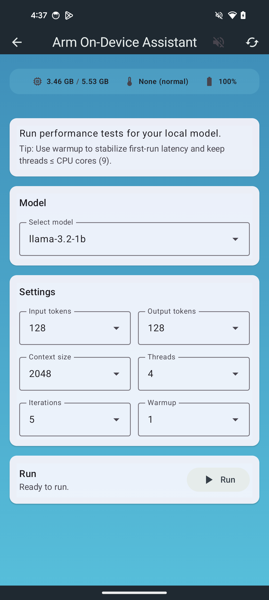
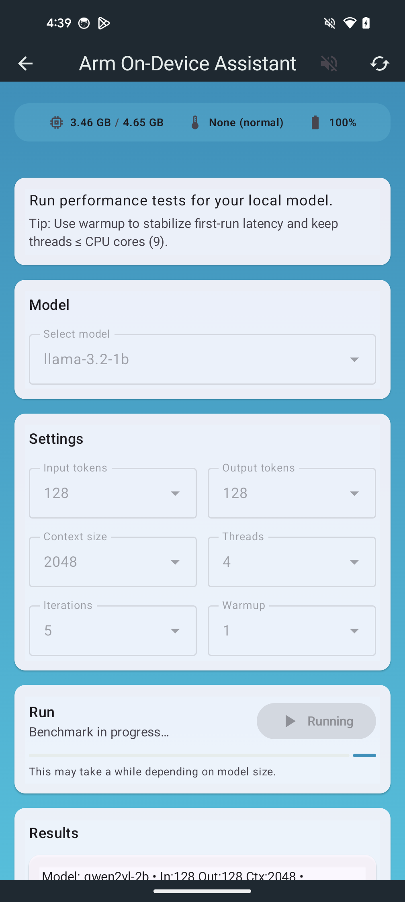
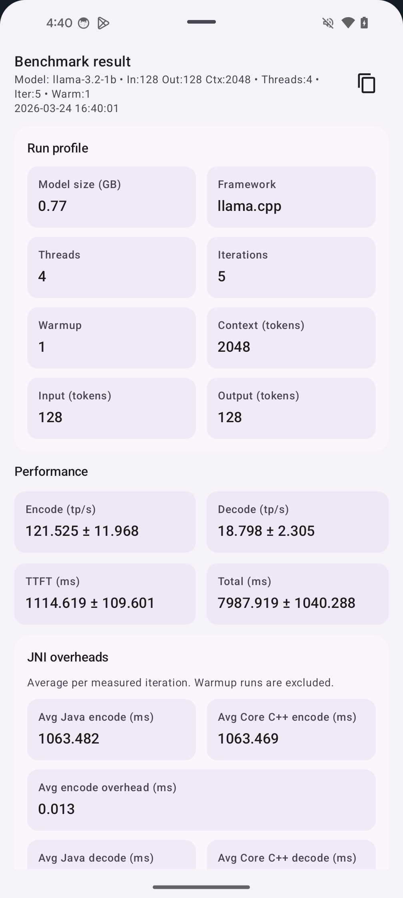

<!--
    SPDX-FileCopyrightText: Copyright 2026 Arm Limited and/or its affiliates <open-source-office@arm.com>

    SPDX-License-Identifier: Apache-2.0
-->

# Benchmarking

This guide focuses on using the application's own benchmarking and logging to evaluate performance.

## What to Measure

Use consistent metrics so results are comparable across devices and builds.

| Metric | Definition |
| --- | --- |
| End-to-end latency |  Time from 'Press to talk' button click to first spoken response |
| STT latency | Audio end to transcription complete |
| LLM TTFT | Time to first token from LLM |
| LLM TPOT | Average time per output token |
| TTS latency | Response ready to audio playback |
| Throughput | Tokens/sec (LLM) or sec/sec (STT) |

## Baseline Procedure (Step-by-Step)

1. Build a release binary.
   ```bash
   ./gradlew assembleRelease
   ```
2. Use a physical device and disable battery saver.
3. Reboot the device to clear background state.
4. Warm up the app with 2-3 runs of the same prompt.
5. Run 5-10 identical prompts and average the metrics.
6. Record model names, build flags, device model, and OS version.

## Using the App's Benchmarks

- Use the app's built-in logging/timing output to capture the metrics listed above.
- Keep prompts and audio files fixed between runs.
- Avoid running with a debugger attached.
- Prefer `release` builds for performance numbers.

## Benchmark UI Walkthrough

Use the benchmark screens in the app to run repeatable tests and capture the results.

<p align="center">
  
  
  
</p>

## Reporting Template

Capture the following in a short report or issue comment:

- Device model + OS version
- Build type + relevant flags (`llmFramework`, `-PkleidiAI`)
- Model names and sizes
- Prompt / audio used
- Table of metrics with averages and sample size

## Common Pitfalls

- Comparing debug vs. release builds
- Changing model or prompt between runs
- Measuring first run only (cold start)
- Running on a thermal-throttled device
- Mixing runs with and without KleidiAI or SME enabled, which can significantly affect performance results
