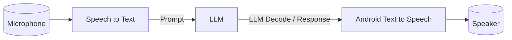

<!--
    SPDX-FileCopyrightText: Copyright 2026 Arm Limited and/or its affiliates <open-source-office@arm.com>

    SPDX-License-Identifier: Apache-2.0
-->

# Build and Configuration Guide

Run the Android Voice Assistant app on a device or emulator with minimal ML experience.
The app records speech, transcribes it, generates a response using an LLM, and plays it back using Android Text-to-Speech.


---

## Table of Contents

- [Quick Start](#quick-start)

- [Prerequisites](#prerequisites)
- [Build from the CLI](#build-from-the-cli)
- [Models and Resources](#models-and-resources)
- [Key Locations](#key-locations)
- [Next Steps](#next-steps)

---

## Quick Start

To get the Android Voice Assistant app running quickly:

1. Open the repo in Android Studio.
2. Let Gradle sync and download dependencies.
3. Select an arm64 or x86_64 device/emulator.
4. Click **Run**.

For command-line builds and model configuration details, continue below.

---

## Prerequisites

| Item | Why you need it |
| --- | --- |
| [Android Studio](https://developer.android.com/studio) | Build and run the app |
| [Android NDK r29](https://developer.android.com/studio/projects/install-ndk) | Native C++ modules |
| CMake 3.27+ | Native builds |
| Python 3 | Push resources/models |
| Device or emulator (arm64 or x86_64) | Run the app |

Create `local.properties` in the repo root if you do not already have one:

```properties
cmake.dir=/path/to/cmake
```
---
## Build from the CLI

```bash
./gradlew assembleDebug
```

To select a different LLM backend at build time:

```bash
./gradlew assembleDebug -PllmFramework=onnxruntime-genai
```

---
## Models and Resources

Model files are downloaded during the build and deployed to the device using the app's resource push script.
If you need to manually push resources later, use:

STT:

```bash
python3 app/pushAppResources.py <local_dir> <device_dir>
```

LLM:

```bash
python3 app/pushAppResources.py <local_dir> <device_dir> --llm_framework <LLM_FRAMEWORK>>
```
For more information please see the documentation in the [LLM Configuration](../README.md#llm-framework) and our [pushAppResources script](../app/pushAppResources.py) script.

---
## Key Locations

| Path | Description |
| --- | --- |
| `app/` | Android app + UI |
| `stt/` | Speech-to-text module |
| `llm/` | LLM module |
| `resources/` | Models and config files |
| `app/src/model_configuration_files/` | LLM/STT config JSON |

---
## Next Steps

- Read [docs/benchmarking.md](benchmarking.md) to measure latency and throughput.
- Review [README.md](../README.md) for configuration options (KleidiAI, LLM backends, custom model configs).
