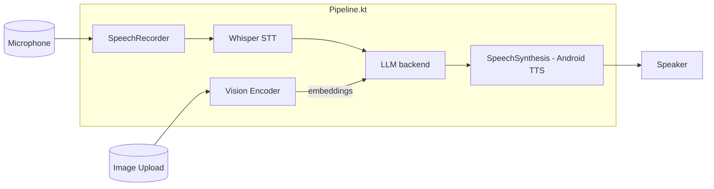

<!--
    SPDX-FileCopyrightText: Copyright 2026 Arm Limited and/or its affiliates <open-source-office@arm.com>

    SPDX-License-Identifier: Apache-2.0
-->

# System Overview

This project is an Android voice assistant application that combines Speech-to-Text (STT), a Large Language Model (LLM), and Text-to-Speech (TTS) into a single on-device pipeline.

## Table of Contents

- [High-Level Modules](#high-level-modules)
- [Runtime Pipeline](#runtime-pipeline)
    - [Speech Synthesis](#speech-synthesis)
- [User Interface Layer](#user-interface-layer)
- [Configuration and Models](#configuration-and-models)
- [LLM Framework Selection](#llm-framework-selection)
- [Optional Visual Question Answering (VQA)](#optional-visual-question-answering-vqa)
- [Key Files](#key-files)

---
## High-Level Modules

- `app/`: Android application (Jetpack Compose UI, view models, pipeline orchestration)
- `stt/`: Speech-to-Text module based on whisper.cpp
- `llm/`: LLM module based on llama.cpp (and other selectable backends)
- `resources/`: Shared assets and model configuration files

---
## Runtime Pipeline

At runtime, the app coordinates the following steps:

1. **Audio capture**: `SpeechRecorder` records microphone input to a local audio file.
2. **Transcription**: `Whisper` (STT) converts audio to text using the configured STT model.
3. **LLM inference**: `Llm` generates a response using the selected LLM backend and model.
4. **Speech output**: `SpeechSynthesis` drives Android Text-to-Speech to speak the response.
5. **UI updates**: The UI receives incremental updates as partial LLM tokens arrive.

The orchestration happens in `app/src/main/java/com/arm/voiceassistant/Pipeline.kt`, which owns the lifecycle of the STT and LLM engines and manages coroutines, state, and error flow.



---
### Speech Synthesis

Speech synthesis happens in the Android app layer via the `SpeechSynthesis` component, which wraps the platform Text-to-Speech engine. It is invoked from `Pipeline.kt` after an LLM response is produced, and the audio is rendered locally on the device.

## User Interface Layer

The UI is built with Jetpack Compose and is organized under:

- `app/src/main/java/com/arm/voiceassistant/ui/`
- `app/src/main/java/com/arm/voiceassistant/ui/screens/`
- `app/src/main/java/com/arm/voiceassistant/ui/composables/`
- `app/src/main/java/com/arm/voiceassistant/viewmodels/`

`MainActivity` sets up the UI, requests microphone permissions, and initializes the main view model.

## Configuration and Models

- **STT config**: `app/src/model_configuration_files/whisperConfig.json`
- **LLM config**: `app/src/model_configuration_files/{Framework}{Text|Vision}ConfigUser.json`
- **Model files**: downloaded during the build and pushed to the device via `app/pushAppResources.py`

The `Pipeline` loads default configs when user configs are missing or invalid, and can read custom configs if provided.

## LLM Framework Selection

The LLM backend is chosen at build time via the `llmFramework` [Gradle property](../gradle.properties). Supported values include:

- `llama.cpp` (default)
- `onnxruntime-genai`
- `mnn`
- `mediapipe`

Example:

```bash
./gradlew assembleDebug -PllmFramework=onnxruntime-genai
```

## Optional Visual Question Answering (VQA)

The app supports optional image-based prompts. An image can be uploaded and encoded into embeddings, which are retained in context for follow-up queries until the context is reset.

## Key Files

- `app/src/main/java/com/arm/voiceassistant/Pipeline.kt`
- `app/src/main/java/com/arm/voiceassistant/MainActivity.kt`
- `app/pushAppResources.py`
- `stt/` and `llm/` module build files and native bindings
